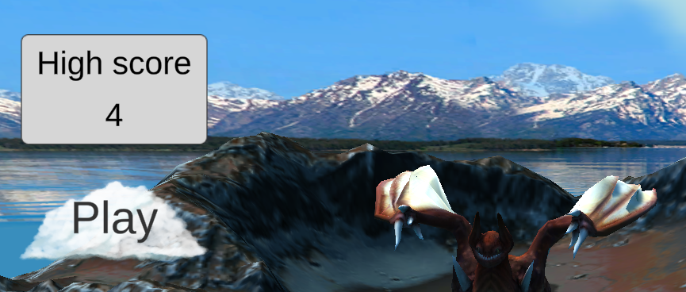
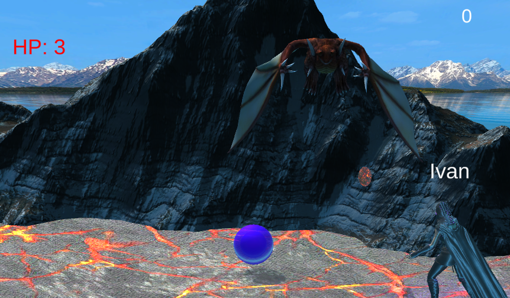
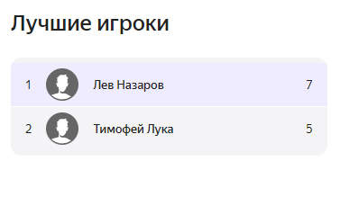
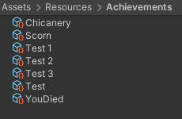
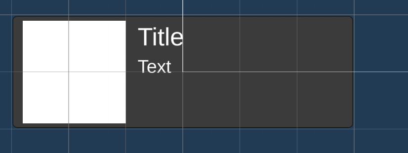
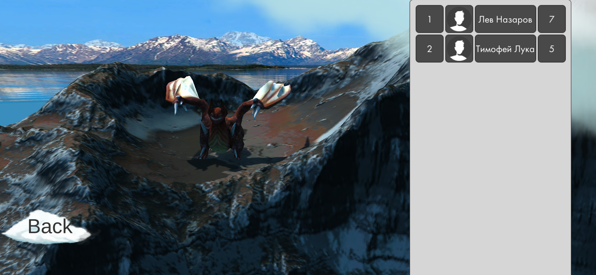

# РАЗРАБОТКА ИГРОВЫХ СЕРВИСОВ
Отчет по лабораторной работе #5 выполнил:
- Назаров Лев Сергеевич
- РИ300012

Отметка о выполнении заданий (заполняется студентом):

| Задание | Выполнение | Баллы |
| ------ | ------ | ------ |
| Задание 1 | * | 60 |
| Задание 2 | * | 20 |
| Задание 3 | * | 20 |

знак "*" - задание выполнено; знак "#" - задание не выполнено;

Работу проверили:
- к.т.н., доцент Денисов Д.В.
- к.э.н., доцент Панов М.А.
- ст. преп., Фадеев В.О.

## Цель работы
Cоздание интерактивного приложения с рейтинговой системой пользователя и интеграция игровых сервисов в готовое приложение.

## Задание 1
### Используя видео-материалы практических работ 1-5 повторить реализацию приведенного ниже функционала:
– 1 Практическая работа «Интеграции авторизации с помощью Яндекс SDK» <br>
– 2 Практическая работа «Сохранение данных пользователя на платформе Яндекс Игры» <br>
– 3 Практическая работа «Сбор данных об игроке и вывод их в интерфейсе» <br>
– 4 Практическая работа «Интеграция таблицы лидеров» <br>
– 5 Практическая работа «Интеграция системы достижений в проект»  <br>

Ход работы:
#### Работа 1: 
1) Создать класс для работы с яндекс играми YGManager:
```cs
public class YGManager : MonoBehaviour
{
    private void Awake()
    {
        YandexGame.GetDataEvent += SdkDataReceived;
    }
    private void SdkDataReceived()
    {
        if (YandexGame.auth)
        {
            Debug.Log($"User authorized: {YandexGame.playerName}");
        }
        else
        {
            Debug.Log("User not authorized, invoking auth dialog");
            YandexGame.AuthDialog();
        }
    }
}
```
2) Проверить авторизацию
#### Работа 2: 
1) Добавить переменную для рекорда очков в класс SavesYG:
```cs
namespace YG
{
    [System.Serializable]
    public class SavesYG
    {
        public bool isFirstSession = true;
        public string language = "ru";
        public bool feedbackDone;
        public bool promptDone;

        // Ваши сохранения
        public int HighScore;
    }
}
```
2) Добавить сохранение рекорда очков:
```cs
private void Quit()
{
    if (score > YandexGame.savesData.HighScore)
    {
        YandexGame.savesData.HighScore = score;
        YandexGame.SaveProgress();
    }
    SceneManager.LoadScene("_0Scene");
}
```
#### Работа 3: 
1) Добавить показ рекорда очков в гл. меню

2) Добавить показ имени игрока в игре

#### Работа 4: 
1) Создать таблицу лидеров в консоли разработчика Яндекс игр
2) Добавить сохранение рекорда очков в таблицу лидеров <br>

```cs
private void Quit()
{
    if (score > YandexGame.savesData.HighScore)
    {
        YandexGame.savesData.HighScore = score;
        YandexGame.SaveProgress();
        YandexGame.NewLeaderboardScores("TOPPlayerScore", score);
    }
    SceneManager.LoadScene("_0Scene");
}
```
#### Работа 5: 
1) Добавить переменную для достижений в класс SavesYG:
```cs
namespace YG
{
    [System.Serializable]
    public class SavesYG
    {
        public bool isFirstSession = true;
        public string language = "ru";
        public bool feedbackDone;
        public bool promptDone;

        // Ваши сохранения
        public int HighScore;
        public int[] Achievements;
    }
}

```
2) Создать класс AchievementSO:
```cs
[CreateAssetMenu(menuName = "Dragon Picker/Achievement")]
[Serializable]
public class AchievementSO : ScriptableObject
{
    public int UniqueID;
    public string Name;
    public string Text;
    public Sprite Icon;
}
```
3) Создать класс AchievementManager:
```cs
public class AchievementManager : MonoBehaviour
{
    public static AchievementManager Instance
    {
        get;
        private set;
    } = null;
    public Dictionary<int, AchievementSO> completedAchievements;
    public Dictionary<int, AchievementSO> allAchievements;
    private void Awake()
    {
        if (Instance == null)
        {
            Instance = this;
        }
        completedAchievements = new Dictionary<int, AchievementSO>();
        allAchievements = new Dictionary<int, AchievementSO>();
        foreach (var a in Resources.LoadAll<AchievementSO>("Achievements"))
        {
            allAchievements.Add(a.UniqueID, a);
        }
        if (YGManager.IsAuthorized)
        {
            LoadData();
        }
        else
        {
            YGManager.AuthSuccess += LoadData;
        }
    }

    public void CompleteAchievement(int id)
    {
        if (allAchievements.ContainsKey(id))
        {
            if (!completedAchievements.ContainsKey(id))
            {
                completedAchievements.Add(id, allAchievements[id]);
                YandexGame.savesData.Achievements = completedAchievements.Keys.ToArray();
                YandexGame.SaveProgress();
            }
        }
    }

    private void LoadData()
    {
        completedAchievements.Clear();
        if (YandexGame.savesData.Achievements != null)
        {
            foreach (var a in YandexGame.savesData.Achievements)
            {
                if (allAchievements.ContainsKey(a))
                {
                    completedAchievements.Add(a, allAchievements[a]);
                }
            }
        }
    }
}
```
4) Создать файлы достиженией в папке Resources/Achievements: <br>

5) Регистрировать выполнение достижений по уникальному ID:
```cs
// проигрыш
if (shieldList.Count == 0)
{
    AchievementManager.Instance.CompleteAchievement(1);
    Quit();
}
```
## Задание 2
### Описать не менее трех дополнительных функций Яндекс SDK, которые могут быть интегрированы в игру. 
1. Реклама - показ рекламы с возможной наградой
2. Внутриигровые покупки
3. Ярлык на рабочем столе - запуск игры с ярлыка на р. столе
4. Оценка игры - просьба оценить игру с возможной наградой
## Задание 3
### Доработать стилистическое оформление списка лидеров и системы достижений, реализованных в задании 1.
1) Создать префаб для достижения

2) Создать класс AchievementsMenu
```cs
public class AchievementsMenu : MonoBehaviour
{
    public GameObject ScrollViewContent;
    public GameObject AchievementPanelPrefab;
    void Start()
    {
        foreach (var achievement in AchievementManager.Instance.allAchievements.Values.OrderBy(a => a.UniqueID))
        {
            var panel = Instantiate(AchievementPanelPrefab, ScrollViewContent.transform);
            if (AchievementManager.Instance.completedAchievements.ContainsKey(achievement.UniqueID))
            {
                panel.GetComponent<Image>().color = Color.green;
            }
            else
            {
                panel.GetComponent<Image>().color = Color.red;
            }
            var icon = panel.transform.Find("Icon").GetComponent<Image>();
            icon.sprite = achievement.Icon;
            var title = panel.transform.Find("Title").GetComponent<TextMeshProUGUI>();
            title.text = achievement.Name;
            var text = panel.transform.Find("Text").GetComponent<TextMeshProUGUI>();
            text.text = achievement.Text;
        }
    }
}
```
3) Создать меню с ScrollView и повесить на него AchievementsMenu

4) Для лидерборда взять префаб Leaderboard Advanced из плагина PluginYG
5) Настроить префаб под наше приложение
6) Создать меню с этим префабом

## Выводы
Научился:
- Сохранять данные в облаке яндекс игр
- Делать лидерборды в яндекс играх и в юнити
- Делать систему достижений в юнити
- Кранчить
## Powered by

**BigDigital Team: Denisov | Fadeev | Panov**
